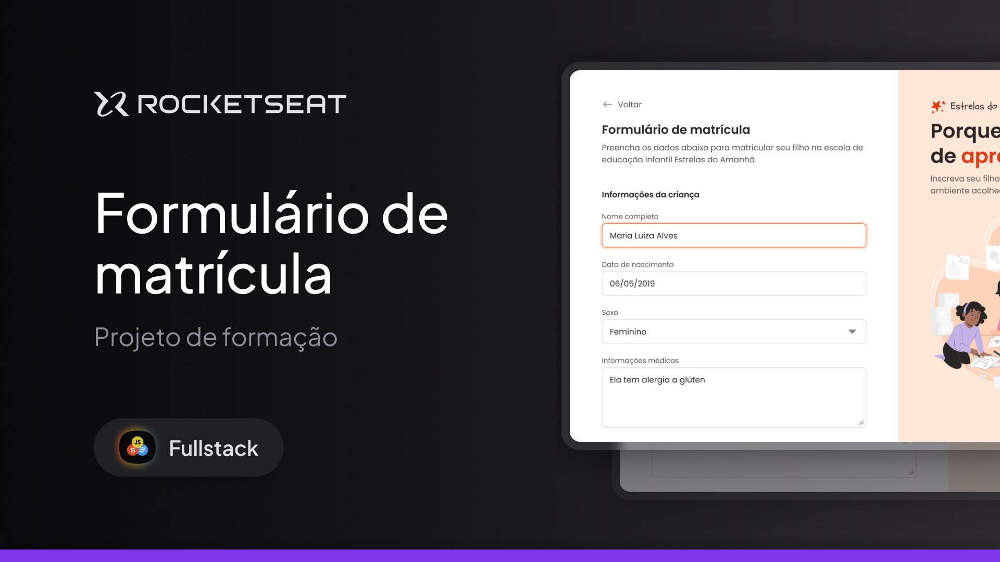

  

Projeto de Formulário da escola Estrala do Amahã.

  <a href="#-tecnologias">Tecnologias</a>&nbsp;&nbsp;&nbsp;|&nbsp;&nbsp;&nbsp;
  <a href="#-projeto">Projeto</a>&nbsp;&nbsp;&nbsp;|&nbsp;&nbsp;&nbsp;
  <a href="#-layout">Layout</a>&nbsp;&nbsp;&nbsp;|&nbsp;&nbsp;&nbsp;
  <a href="#memo-licença">Licença</a>

  

 

  

## 🚀 Tecnologias

Esse projeto foi desenvolvido com as seguintes tecnologias:

- HTML
- CSS
- Git e Github
- Figma
- Formulários

## 💻 Projeto

Nesse projeto iremos desenvolver um formulário de matrícula para a escola Estrela do Amanhã

- [Acesse o projeto finalizado, online](https://fernando-parise.github.io/formulario-de-matricula/)

## 🔖 Layout

Você pode visualizar o layout do projeto através [DESSE LINK](https://www.figma.com/proto/cOgCQ9GztEhHG3ObOCZw0J/Formul%C3%A1rio-de-matr%C3%ADcula--Community-?node-id=915-685&t=Zq3jle1rzV6h1ncv-1). É necessário ter conta no [Figma](https://figma.com) para acessá-lo.

## :memo: Licença

Esse projeto está sob a licença MIT.